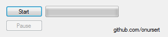

# Screen Capture

Screen Capture (with Microsoft.Expression.Encoder) - 2018 (C#)

Screen Capture is a lightweight tool for Windows PCs allows you to record the contents of a screen within a real-time scenario.

The interface consists of a small screen that allows you to start or stop recording easily. This app uses <a href="https://www.microsoft.com/en-us/download/details.aspx?id=18974">Microsoft Expression Encoder</a> for recording process.

Screen Capture app doesn't require installation.

<a href="https://github.com/onursert/ScreenCapture/raw/master/ScreenCapture.zip">Download Screen Capture</a>
